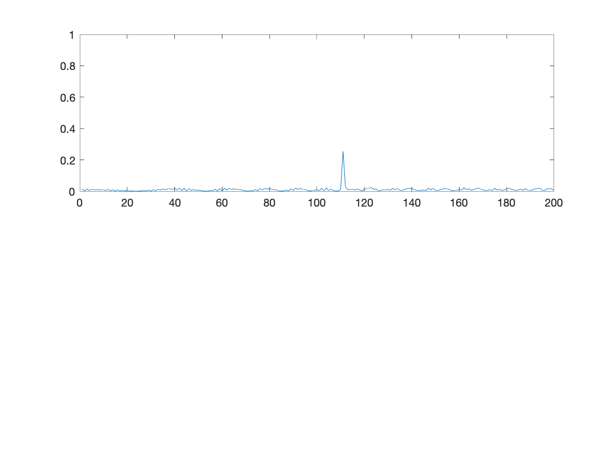
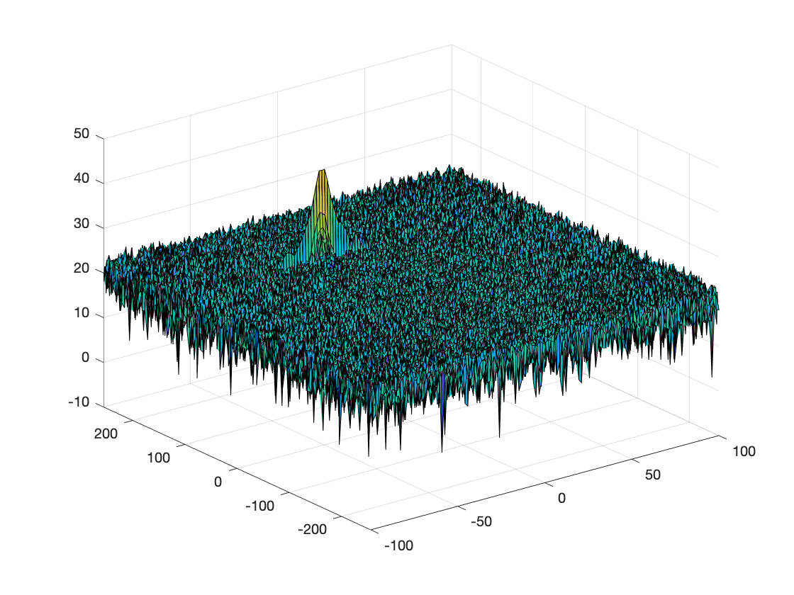
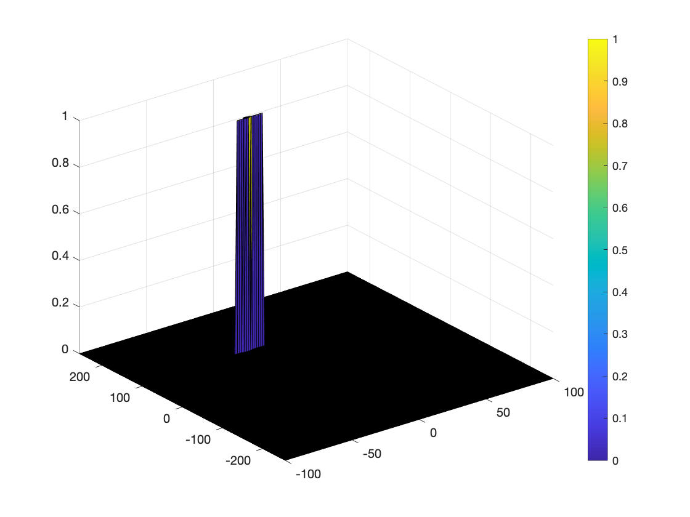

# SFND_Radar_Target_Generation_and_Detection

This project is part of the Sensor Fusion Nanodegree program and aims to generate a target at a given range, and detect this target through a FMCW radar.

## Project Overview
* Configure the FMCW waveform based on the system requirements.
* Define the range and velocity of target and simulate its displacement.
* For the same simulation loop process the transmit and receive signal to determine the beat signal
* Perform Range FFT on the received signal to determine the Range
Towards the end, perform the CFAR processing on the output of 2nd FFT to display the target.

## Radar Systems Requirements
|Requirements|Values|
|-|-|
|Range resolution|1 m|
|Max range|200 m|
|Max velocity|70 m/s|
|Velocity resolution|3 m/s|

System Requirements defines the design of a Radar. The sensor fusion design for different driving scenarios requires different system configurations from a Radar. In this project, you will designing a Radar based on the given system requirements (above).

## Code explanation

Now, I will explain every step of the code in the file `Radar_Target_Generation_And_Detection.m`.
 
 ### Requirements Definition
 ```
 %% Radar Specifications 
%%%%%%%%%%%%%%%%%%%%%%%%%%%
% Frequency of operation = 77GHz
% Max Range = 200m
% Range Resolution = 1 m
% Max Velocity = 100 m/s
%%%%%%%%%%%%%%%%%%%%%%%%%%%

%speed of light = 3e8
%% User Defined Range and Velocity of target
% define the target's initial position and velocity. Note : Velocity
% remains contant
R = 110;
v = -20;

%% FMCW Waveform Generation
%Design the FMCW waveform by giving the specs of each of its parameters.
% Calculate the Bandwidth (B), Chirp Time (Tchirp) and Slope (slope) of the FMCW
% chirp using the requirements above.

%Speed of light
c = 3*10^8;

%Radar maximum range = 200m
Rmax = 200;

%The range resolution = 1m
delta_r = 1;

Bsweep = c/2*delta_r;

Tchirp = 5.5*2*Rmax/c;

slope = Bsweep/Tchirp;

%Operating carrier frequency of Radar 
fc= 77e9;             %carrier freq
````
### Signal Generation and Moving Target Estimation
```
for i=1:length(t)         
    %For each time stamp update the Range of the Target for constant velocity. 
    r_t(i) = R + (v*t(i)); % range_covered
    td(i) = (2*r_t(i)) / c; % time delay

    %For each time sample we need update the transmitted and
    %received signal. 
    Tx(i) = cos(2*pi*(fc*t(i)+slope*t(i)^2/2));
    Rx(i)  = cos(2*pi*(fc*(t(i)-td(i))+slope*(t(i)-td(i))^2/2));

    %Now by mixing the Transmit and Receive generate the beat signal
    %This is done by element wise matrix multiplication of Transmit and
    %Receiver Signal
    %Mix(i) = cos(2*pi*(2*slope*r_t(i)*t(i)/c+2*fc*v/c*t(i)));
    Mix(i) = Tx(i).*Rx(i);
end
```

### Range Measurement
```
%% RANGE MEASUREMENT 

%reshape the vector into Nr*Nd array. Nr and Nd here would also define the size of
%Range and Doppler FFT respectively.
Mix = reshape(Mix, [Nr,Nd]);

%run the FFT on the beat signal along the range bins dimension (Nr) and
%normalize.
sig_fft1= fft(Mix,Nr);
sig_fft1 = sig_fft1./Nr;

% Take the absolute value of FFT output
P2 = abs(sig_fft1);
%size(P2)

% Output of FFT is double sided signal, but we are interested in only one side of the spectrum.
% Hence we throw out half of the samples.
P1 = P2(1:Nr/2+1);

```
And the output is:


### Range doppler response

```
% 2D FFT using the FFT size for both dimensions.
sig_fft2 = fft2(Mix,Nr,Nd);

% Taking just one side of signal from Range dimension.
sig_fft2 = sig_fft2(1:Nr/2,1:Nd);
sig_fft2 = fftshift (sig_fft2);
RDM = abs(sig_fft2);
RDM = 10*log10(RDM) ;
```

And the surf plot  is:


### 2D CFAR implementation
The code is as follows:
```
%% CFAR implementation

%Select the number of Training Cells in both the dimensions.
Tr = 10;
Td = 8;

%Select the number of Guard Cells in both dimensions around the Cell under 
%test (CUT) for accurate estimation
Gr = 4;
Gd = 4;

% offset the threshold by SNR value in dB
offset = 10;

%Slide Window through the complete Range Doppler Map
for i = Tr+Gr+1:(Nr/2)-(Tr+Gr)
    for j = Td+Gd+1:Nd-(Td+Gd)
        %Create a vector to store noise_level for each iteration on training cells
        noise_level = zeros(1,1);
        for p = i-(Tr+Gr):i+Tr+Gr
            for q = j-(Td+Gd):j+Td+Gd
                if (abs(i-p)>Gr || abs(j-q)>Gd)
                    noise_level = noise_level + db2pow(RDM(p,q));
                end
            end
        end
           % Use RDM[x,y] as the matrix from the output of 2D FFT for implementing
           % CFAR
        threshold = pow2db(noise_level/(2*(Td+Gd+1)*2*(Tr+Gr+1)-(Gr*Gd)-1)); 
        % Add the SNR offset to the threshold
        threshold = threshold + offset;

        % Measure the signal in Cell Under Test (CUT) and compare against
        CUT = RDM(i,j);
        
        if(CUT<threshold)
            RDM(i,j) = 0;
        else
            RDM(i,j) = 1;
        end
    end
end
```
* Determine the number of Training cells for each dimension. Similarly, pick the number of guard cells.

The number of training cells and guard cells that gave good results were:
```
%Select the number of Training Cells in both the dimensions.
Tr = 10;
Td = 8;

%Select the number of Guard Cells in both dimensions around the Cell under 
%test (CUT) for accurate estimation
Gr = 4;
Gd = 4;

% offset the threshold by SNR value in dB
offset = 10;
```

* Slide the cell under test across the complete matrix. Make sure the CUT has margin for Training and Guard cells from the edges.

```
for i = Tr+Gr+1:(Nr/2)-(Tr+Gr)
    for j = Td+Gd+1:Nd-(Td+Gd)
        .
        .
        .
    end
end
```

* For every iteration sum the signal level within all the training cells. To sum convert the value from logarithmic to linear using db2pow function.

```
        .
        .
        .
        noise_level = zeros(1,1);
        for p = i-(Tr+Gr):i+Tr+Gr
            for q = j-(Td+Gd):j+Td+Gd
                if (abs(i-p)>Gr || abs(j-q)>Gd)
                    noise_level = noise_level + db2pow(RDM(p,q));
                end
            end
        end
           .
           .
           .
```

* Average the summed values for all of the training cells used. After averaging convert it back to logarithmic using pow2db.

```
        .
        .
        .
           % Use RDM[x,y] as the matrix from the output of 2D FFT for implementing
           % CFAR
        threshold = pow2db(noise_level/(2*(Td+Gd+1)*2*(Tr+Gr+1)-(Gr*Gd)-1)); 
        .
        .
        .

```
* Further add the offset to it to determine the threshold.

```
        .
        .
        .
        % Add the SNR offset to the threshold
        threshold = threshold + offset;
        .
        .
        .
```
* Next, compare the signal under CUT against this threshold and if the CUT level > threshold assign it a value of 1, else equate it to 0.

```
        .
        .
        .
        % Measure the signal in Cell Under Test (CUT) and compare against

        CUT = RDM(i,j);
        
        if(CUT<threshold)
            RDM(i,j) = 0;
        else
            RDM(i,j) = 1;
        end
        .
        .
        .
```

* To keep the map size same as it was before CFAR, equate all the non-thresholded cells to 0.
```
RDM(union(1:(Tr+Gr),end-(Tr+Gr-1):end),:) = 0;
RDM(:,union(1:(Td+Gd),end-(Td+Gd-1):end)) = 0;
```
This operation set to 0 the boundaries of the matriz that were not evaluated and the output of the CFAR algorithm is:


